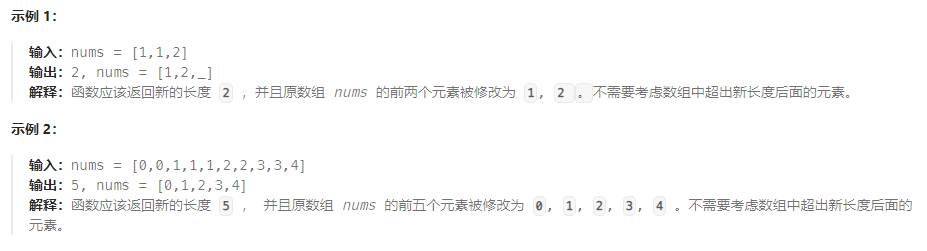
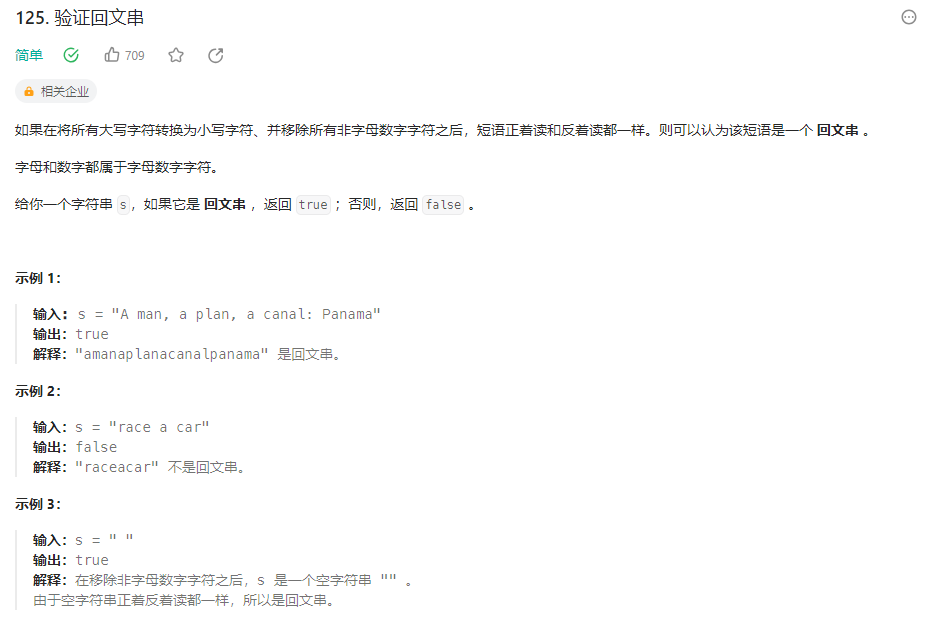
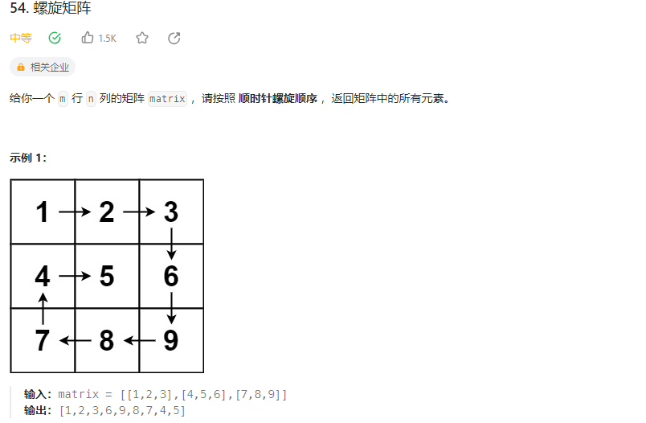

### 面试经典150题

#### 一.数组/字符串

##### 1.合并两个有序数组（88）


**思路：**最简单的想法：`nums2`中数放在`nums1`后面，然后排序`Arrays.sort(nums1)`。

进阶要求复杂度`O(m+n)`复杂度：双指针，`i`指向`nums1`的要排入的数，`j`指向`nums2`的要排入的数，需要一个辅助数组。

再进阶要求空间复杂度`O(1)`，不能用辅助数组：双指针，但是从后往前排，这样就可以直接利用`nums1`后面的空数组了。

```java
//方法1，插入后直接排序
class Solution {
    public void merge(int[] nums1, int m, int[] nums2, int n) {
    	//nums2的元素插入到nums1后面
        for(int i = m; i < m+n; i++){
            nums1[i] = nums2[i-m];
        }
        Arrays.sort(nums1);
    }
}
//方法2，双指针从前往后，用一个辅助数组暂时存排好序的数组
class Solution {
    public void merge(int[] nums1, int m, int[] nums2, int n) {
    	//辅助数组
        int[] temp = new int[m+n];
        //index遍历temp，i指向下一个nums1的数，j指向下一个num2的数
        int index = 0, i = 0, j = 0;
        while(i < m && j < n){
        	//i指向的数小，选nums1
            if(nums1[i] <= nums2[j]){
                temp[index++] = nums1[i++];
            }
            else{
                temp[index++] = nums2[j++];
            }
        }
        //其中一个数组遍历完成，剩下一个数组按次序接在后面即可
        while(i < m){
            temp[index++] = nums1[i++];
        }
        while(j < n){
            temp[index++] = nums2[j++];
        }
        for(i = 0; i < m+n; i++){
            nums1[i] = temp[i];
        }
    }
}
//方法3，双指针从后往前，利用nums1后边空缺的空间，不再需要辅助数组
class Solution {
    public void merge(int[] nums1, int m, int[] nums2, int n) {
    	//定义三个指针，index指向nums1最后，i指向num1有效数据最后，j指向num2最后
        int index = m+n-1, i = m-1, j = n-1;
        while(i >= 0 && j >= 0){
        	//选大的数从后放入nums1
            if(nums1[i] >= nums2[j]){
                nums1[index--] = nums1[i--];
            }
            else{
                nums1[index--] = nums2[j--];
            }
        }
        //可能nums2还有剩余，直接覆盖，nums1剩余就不用处理了，本来就在nums1中
        while(j >= 0){
            nums1[index--] = nums2[j--];
        }
    }
}
```

##### 2.移除元素（27）


**思路：**双指针，i指向下一个遍历的数，j指向下一个要保留的位置。简单来说就是在遍历过程中记住要更新的位置，判断当前遍历数能否到更新位置

```java
class Solution {
    public int removeElement(int[] nums, int val) {
    	//记录下一个要更新的位置
        int index = 0;
        for(int i = 0; i < nums.length; i++){
        	//满足题目要求时，填充要更新的位置
            if(nums[i] != val){
                nums[index++] = nums[i];
            }
        }
        return index;
    }
}
```

##### 3.删除有序数组中的重复项（26）




**思路：**记录下当前合法数组的最后一个数和下一次要更新的位置，遍历数组即可

```java
class Solution {
    public int removeDuplicates(int[] nums) {
    	//第一个数是必保留的，最后一个合法数val，要更新的位置为index
        int val = nums[0], index = 1;
        for(int i = 0; i < nums.length; i++){
        	//当前数字与最后一个合法数不相等，那么这个数字也应当是合法的
            if(nums[i] != val){
                nums[index++] = nums[i];
                val = nums[i];
            }
        }
        return index;
    }
}
```

##### 4.删除有序数组中的重复项Ⅱ（80）


**思路：**和上一题完全一样，只是出现次数有变化，首先，前两个数是必被保留的，记录倒数第二个合法数和下一个更新位置即可。

```java
class Solution {
    public int removeDuplicates(int[] nums) {
    	//前两个数必被保留，val记录合法数的倒数第二个那就是nums[0]，下一个更新位置index = 2
        int val = nums[0], index = 2;
        for(int i = 2; i < nums.length; i++){
        	//当前数合法，更新当前位置
            if(nums[i] != val){
                nums[index++] = nums[i];
                //注意val是倒数第二个，注意index-2即可
                val = nums[index-2];
            }
        }
        return index;
    }
}
```

##### 5.多数元素


**思路：**最简单的：排序，取`2/n`位置的数

进阶`O(n)`时间复杂度：计数，用HashMap记录数字和数量

再进阶`O(1)`空间复杂度：摩尔投票法，思路是基于目标数比其他所有数加起来的数量都多，遇到目标数+1，非目标数-1，最后的结果就会大于0

```java
//方法1，排序取2/n
class Solution {
    public int majorityElement(int[] nums) {
        Arrays.sort(nums);
        return nums[nums.length/2];
    }
}
//方法2，HashMap计数
class Solution {
    public int majorityElement(int[] nums) {
    	//<数字，数量>
        HashMap<Integer, Integer> map = new HashMap<>();
        int maxNum = Integer.MIN_VALUE, res = 0;
        for(int i = 0; i < nums.length; i++){
            if(map.containsKey(nums[i])){
                int val = map.get(nums[i])+1;
                map.put(nums[i], val);
                if(maxNum < val){
                    maxNum = val;
                    res = nums[i];
                }
            }
            else{
                map.put(nums[i], 1);
                if(maxNum < 1){
                    maxNum = 1;
                    res = nums[i];
                }
            }
        }
        return res;
    }
}
//方法3.摩尔计数法，如果vote==0，把当前数定为目标数，和目标数相同vote++，和他不同vote--
class Solution {
    public int majorityElement(int[] nums) {
        int res = 0;
        int vote = 0;
        for(int i = 0; i < nums.length; i++){
            //vote为零时给目标数赋值
            if(vote == 0){
                res = nums[i];
            }
            //当前数等于目标数，vote++
            if(res == nums[i]){
                vote++;
            }
            //当前数不等于目标数，vote--
            else{
                vote--;
            }
        }
        return res;
    }
}
```

##### 6.轮转数组（189）


**思路：**一般想法：模拟，用一个中间数组记录每次变换后的元素，最后把这个数组的值赋给原来的数组

进阶`O(1)`空间复杂度：翻转数组三次，一次整体，一次从头到分割点，一次从分割点到尾。比较难想，记住有这样的方法即可

```java
//方法1：模拟，位置变成了(k+i)%len
class Solution {
    public void rotate(int[] nums, int k) {
        int len = nums.length;
        int temp[] = new int[len];
        for(int i = 0; i < len; i++){
            temp[(k+i)%len] = nums[i];
        }
        for(int i = 0; i < len; i++){
            nums[i] = temp[i];
        }
    }
}
//方法2：翻转三次数组
class Solution {
    public void rotate(int[] nums, int k) {
        k = k % nums.length;
        //整体翻转
        reverse(nums, 0, nums.length-1);
        //翻转0到分割点位置
        reverse(nums, 0, k-1);
        //翻转分割点到结束位置
        reverse(nums, k, nums.length-1);
    }
    public void reverse(int[] nums, int left, int right){
        for(int i = left, j = right; i < j; i++, j--){
            int temp = nums[i];
            nums[i] = nums[j];
            nums[j] = temp;
        }
    }
}
```

##### 7.买卖股票的最佳时机（121)


**思路：**假设每一天都卖股票，然后取最大值，那么就要记录当天卖股票之前的买入最小值。

```java
class Solution {
    public int maxProfit(int[] prices) {
    	//lowPrice记录要卖股票时前段时间的最小买入值
        int lowPrice = prices[0];
        int res = 0;
        for(int i = 0; i < prices.length; i++){
        	//当天卖股票，更新最大利润
            res = Math.max(res, prices[i]-lowPrice);
            //今天买入值更低则更新买入值
            lowPrice = Math.min(lowPrice, prices[i]);
        }
        return res;
    }
}
```

##### 8.买卖股票的最佳时机Ⅱ（122）


**思路：**可以先购买在同一天出售，那么每天都购买股票也能保证收益不会减少。每天手上都持有股票，若卖出价变高，可以卖出再买入，至少把今天的差价赚到，若卖出价变低，此时不卖股票，但可以更新买入价，相当于之前买了之后当天卖掉，不赚不赔，然后今天更低价买入。

```java
class Solution {
    public int maxProfit(int[] prices) {
    	//今天手持股票的买入价inPrice
        int inPrice = prices[0];
        int res = 0;
        for(int i = 0; i < prices.length; i++){
        	//当天卖出价高，先把今天的差价赚到
            if(prices[i] > inPrice){
                res += prices[i] - inPrice;
                inPrice = prices[i];
            }
            //当天的卖出价低，相当于之前持有的股票当天买当天卖，今天又以低价购入
            inPrice = Math.min(inPrice, prices[i]);
        }
        return res;
    }
}
```

##### 9.跳跃游戏（55）


**思路：**记录当前能到达的最远距离，遍历每一个位置，如果当前位置在可达距离范围内，尝试更新是否能到更远（当前位置+跳跃位置）

```java
class Solution {
    public boolean canJump(int[] nums) {
    	//记录能到达的最远距离，初始在下标0的地方
        int reach = 0;
        for(int i = 0; i < nums.length; i++){
        	//当前位置在reach范围内
            if(i <= reach){
            	//判断reach距离和（当前位置+跳跃位置）哪个更远
                reach = Math.max(reach, i+nums[i]);
            }
        }
        return reach >= nums.length-1;
    }
}
```

##### 10.跳跃游戏Ⅱ（45）


**思路：**（题目保证能跳完）每次到达一个位置，都记录下一次跳跃能到的最远位置，当前位置跳不了的时候，就需要再跳一步，再跳一步后能到的最远位置就是之前记录好了的

```java
class Solution {
    public int jump(int[] nums) {
    	//reach为当前能到达的最远位置
        int reach = 0;
        //nextMaxJump为再跳一次能到达的最远位置
        int nextMaxJump = 0;
        int res = 0;
        for(int i = 0; i < nums.length; i++){
        	//当前位置跳不到了，那就要跳一次，更新最远位置，更新后就能跳到了
            if(i > reach){
                reach = nextMaxJump;
                res++;
            }
            //每一次都记录是不是可能跳更远
            nextMaxJump = Math.max(nextMaxJump, i+nums[i]);
        }
        return res;
    }
}
```

#### 二、双指针

##### 1.验证回文串（125）



**思路：**指针`i`从前往后，指针`j`从后往前，遇到字母数字字符就做比较，指导两个指针相遇

```java
class Solution {
    public boolean isPalindrome(String s) {
        s = s.toLowerCase();
        int i = 0, j = s.length()-1;
        while(i < j){
            while(i < j && !Character.isLetterOrDigit(s.charAt(i))){
                i++;
            }
            while(i < j && !Character.isLetterOrDigit(s.charAt(j))){
                j--;
            }
            if(i < j && s.charAt(i) != s.charAt(j)){
                return false;
            }
            i++;j--;
        }
        return true;
    }
}
```

##### 2.判断子序列（392）


**思路：**双指针，遍历`t`的时候，只要匹配到了`s`的字符，那么`s`的字符指针就往下移动，如果能遍历完`s`说明`s`是`t`的子串

进阶：匹配过程主要是找`t`中满足要求的下一个字符，如果我们把`t`下一个字符出现的位置记住，就可以通过遍历`s`的字符来实现匹配

动态规划：`f[i][j]`表示从下标`i`开始，字符`j`第一次出现的位置（下标）
$$
f[i][j]=\left\{\begin{matrix}
i,\ \ \ \ \ \ \ \ \ \ \ \ \ \ \  t[i]=j
 \\
f[i+1][j],t[i]\neq j
\end{matrix}\right.
$$
解释：当前位置`i`的字符就是`j`的时候，字符`j`第一次出现位置那就是`i`，

​			当前位置字符不是`j`的时候，一定是下一个位置开始`j`第一次出现的位置，就是`f[i+1][j]`。

```java
//简单问题，遍历t的过程中匹配s的字符
class Solution {
    public boolean isSubsequence(String s, String t) {
        int i = 0, j = 0;
        while(i < s.length() && j < t.length()){
        	//匹配成功，s的指针移动到下一个字符
            if(s.charAt(i) == t.charAt(j)){
                i++;
            }
            j++;
        }
        return i == s.length();
    }
}
//进阶问题，动态规划
class Solution {
    public boolean isSubsequence(String s, String t) {
    	//dp多增加一行，这一行字符为空，必定不可到达，记为标志位-1
        int[][] dp = new int[t.length()+1][26];
        for(int i = 0; i < 26; i++){
            dp[t.length()][i] = -1;
        }
        //从后往前dp，因为多增加了一行，使最后一个字符的更新规则也和前面字符相同了
        for(int i = t.length()-1; i >= 0; i--){
            for(int j = 0; j < 26; j++){
            	//i当前位置的字符就是j的时候，字符j第一次出现位置设为i
                if(t.charAt(i)-'a' == j){
                    dp[i][j] = i;
                }
                //i当前位置字符不是j，那么j第一次出现位置开始递推dp[i+1][j]
                else{
                    dp[i][j] = dp[i+1][j];
                }
            }
        }
        int i = 0;
        //遍历字符串s的字符，i为字符串t寻找匹配字符的位置
        for(int k = 0; k < s.length(); k++){
            int j = s.charAt(k)-'a';
            //当前的字符没有找到下一个出现位置，意味着这个字符在后续字符串不出现了
            if(dp[i][j] == -1){
                return false;
            }
            //找到了字符的下一个出现位置，那么更新寻字符串的位置到+1，从新位置继续出发进行匹配
            i = dp[i][j]+1;
        }
        return true;
    }
}
```

##### 3.两数之和Ⅱ-输入有序数组（167）


**思路：**最重要的就是利用好输出的数组是有序的，从小到大排序，那么指针`i`从前往后，指针`j`从后往前遍历即可

```java
class Solution {
    public int[] twoSum(int[] numbers, int target) {
        int i = 0, j = numbers.length-1;
        while(i < j){
        	//相等，直接输出
            if(numbers[i] + numbers[j] == target){
                return new int[]{i+1, j+1};
            }
            //小，那么左指针右移
            else if(numbers[i] + numbers[j] < target){
                i++;
            }
            //大，右指针左移
            else{
                j--;
            }
        }
        return null;
    }
}
```

##### 4.盛最多水的容器


**思路：**遍历不同的边界，计算面积更新返回值，关键在于要怎么遍历，两条边界用双指针遍历，`i`从左往右，`j`从右往左，注意到遍历过程中间距在缩小，面积要想变大，只可能边界高度变大，那么就需要移动两边较小的边，因为如果移动较大的边，面积是一定回缩小的。

```java
class Solution {
    public int maxArea(int[] height) {
    	//左边界i，右边界j
        int i = 0, j = height.length-1;
        int res = 0;
        while(i < j){
            res = Math.max(res, (j-i) * Math.min(height[i], height[j]));
            //左边界小，那么左指针右移
            if(height[i] < height[j]){
                i++;
            }
            //右边界小，那么右指针左移
            else{
                j--;
            }
        }
        return res;
    }
}
```

##### 5.三数之和（15）


**思路：**排序+双指针，排序之后就可以仿照两数之和的问题，`i`指针从前往后，`j`指针从后往前遍历，主要还要再处理不可重复，使用`set`记录每一次用过的元素。

```java
class Solution {
    public List<List<Integer>> threeSum(int[] nums) {
    	//排序
        Arrays.sort(nums);
        //过滤已经用过的元素
        Set<Integer> set = new HashSet<>();
        List<List<Integer>> res = new LinkedList<>();
        for(int i = 0; i < nums.length; i++){
            if(set.contains(nums[i])){
                continue;
            }
            else{
                set.add(nums[i]);
                int j = i+1, k = nums.length-1;
                while(j < k){
                	//符合题意，加入res
                    if(nums[i]+nums[j]+nums[k] == 0){
                        List<Integer> temp = new LinkedList<>();
                        temp.add(nums[i]);
                        temp.add(nums[j]);
                        temp.add(nums[k]);
                        res.add(temp);
                        int preLeft = nums[j];
                        j++;
                        //要防止i指针和j指针的下一个和这一个全都相同，这样也会出现重复
                        while(j < k && preLeft == nums[j]){
                            j++;
                        }
                         k--;
                    }
                    else if(nums[i]+nums[j]+nums[k] < 0){
                        j++;
                    }
                    else{
                        k--;
                    }
                }
            }
        }
        return res;
    }
}
```

#### 三、滑动窗口

##### 1.长度最小的子数组（209）


**思路：**滑动窗口，也可以认为是双指针，指针`i`指向子数组左侧，`j`指向子数组右侧，遍历指针`j`，每次增加一个数时，判断`i`要右移到哪一步，注意子数组的长度是`j-i+1`。

```java
class Solution {
    public int minSubArrayLen(int target, int[] nums) {
        int sum = 0, i = 0, j = 0, res = Integer.MAX_VALUE;
        while(j < nums.length){
        	//指针j所指的数加入子数组
            sum += nums[j];
            //指针i右移直到和值小于目标数
            while(sum >= target){
                res = Math.min(res, j-i+1);
                sum -= nums[i];
                i++;
            }
            j++;
        }
        return res == Integer.MAX_VALUE? 0 : res;
    }
}
```

##### 2.无重复字符的最长字串（3）


**思路：**滑动窗口，或者理解为双指针，和上题基本相同，这一题要记录好已经出现的字符即可

```java
class Solution {
    public int lengthOfLongestSubstring(String s) {
    	//set记录已经存在的字符
        HashSet<Character> chars = new HashSet<>();
        int start = 0;
        int end = 0;
        int res = 0;
        while(end < s.length()){
            char c = s.charAt(end);
            //当前字符保证不存在
            while(chars.contains(c)){
                chars.remove(s.charAt(start));
                start++;
            }
            //添加当前字符，更新返回值
            chars.add(c);
            res = Math.max(res, end-start+1);
            end++;
        }
        return res;
    }
}
```

#### 四、矩阵

##### 1.有效的数独（36）


**思路：**模拟，记录每一种是否满足即可，可以使用hash结构一次遍历全部记录

```java
class Solution {
    public boolean isValidSudoku(char[][] board) {
        int[][] rows = new int[9][9];
        int[][] columns = new int[9][9];
        int[][][] subboxes = new int[3][3][9];
        for (int i = 0; i < 9; i++) {
            for (int j = 0; j < 9; j++) {
                char c = board[i][j];
                if (c != '.') {
                    int index = c - '0' - 1;
                    //注意i和j的区分
                    rows[i][index]++;
                    columns[j][index]++;
                    subboxes[i / 3][j / 3][index]++;
                    if (rows[i][index] > 1 || columns[j][index] > 1 || subboxes[i / 3][j / 3][index] > 1) {
                        return false;
                    }
                }
            }
        }
        return true;
    }
}
```

##### 2.螺旋矩阵（54）

##### 


**思路：**模拟，记录每一次遍历的移动方向和边界，在遇到边界时改变移动方向。

```java
class Solution {
    public List<Integer> spiralOrder(int[][] matrix) {
        int m = matrix.length;
        int n = matrix[0].length;
        //direction为方向，boundary为该方向的移动边界，0向右，1向下，2向左，3向上
        int direction = 0, i = 0, j = 0;
        int[] boundary = new int[]{n-1, m-1, 0, 1};
        List<Integer> list = new LinkedList<>();
        for(int k = 0; k < m*n; k++){
            list.add(matrix[i][j]);
            //当前前进方向为向右，如果到达边界，则会向下，后面类似
            if(direction == 0){
                if(j == boundary[0]){
                    direction = 1;
                    boundary[0]--;
                    i++;
                }
                else{
                    j++;
                }
            }
            else if(direction == 1){
                if(i == boundary[1]){
                    direction = 2;
                    boundary[1]--;
                    j--;
                }
                else{
                    i++;
                }
            }
            else if(direction == 2){
                if(j == boundary[2]){
                    direction = 3;
                    boundary[2]++;
                    i--;
                }
                else{
                    j--;
                }
            }else{
                if(i == boundary[3]){
                    direction = 0;
                    boundary[3]++;
                    j++;
                }
                else{
                    i--;
                }
            }
        }
        return list;
    }
}
```

