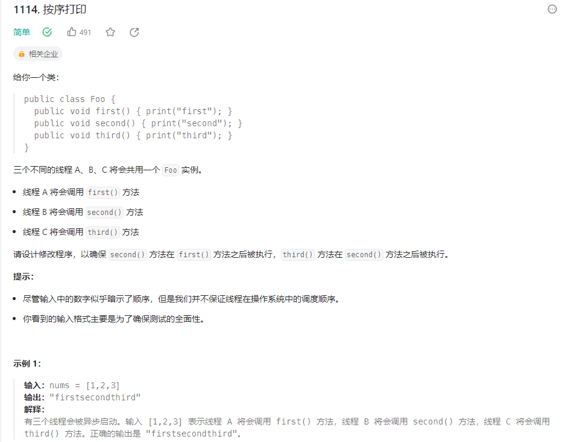
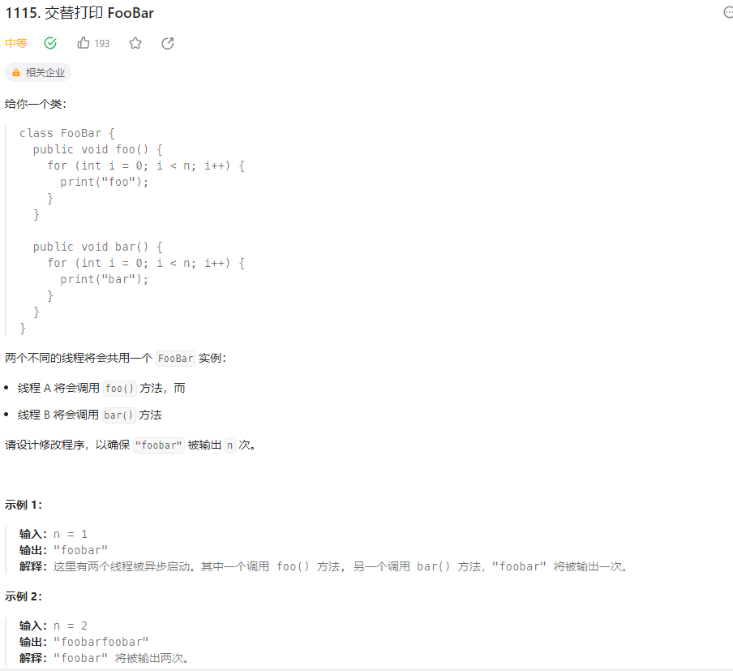
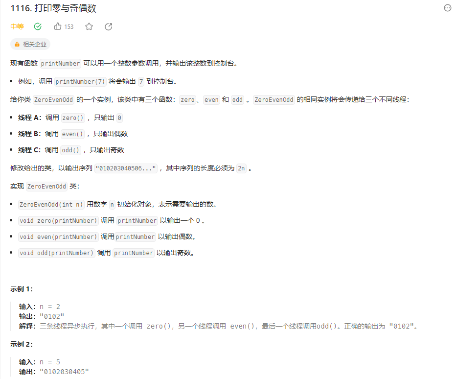

### 多线程

##### 1.按序打印（1114）



```java
//synchronized关键字控制打印流程
class Foo {

    private int flag = 1;

    public Foo() {
        
    }

    public void first(Runnable printFirst) throws InterruptedException {
        synchronized(this){
        	//flag不是1时挂起
            while(flag != 1){
                wait();
            }
            printFirst.run();
            flag++;
            //唤醒所有挂起的线程
            notifyAll();
        }
        // printFirst.run() outputs "first". Do not change or remove this line.
        
    }

    public void second(Runnable printSecond) throws InterruptedException {
        synchronized(this){
            while(flag != 2){
                wait();
            }
            printSecond.run();
            flag++;
            notifyAll();
        }
        // printSecond.run() outputs "second". Do not change or remove this line.
        
    }

    public void third(Runnable printThird) throws InterruptedException {
        synchronized(this){
            while(flag != 3){
                wait();
            }
            printThird.run();
            flag++;
            notifyAll();
        }
        // printThird.run() outputs "third". Do not change or remove this line.
    }
}
//使用信号量
class Foo {

    private Semaphore semaphore12, semaphore23;

    public Foo() {
        //信号量初始化为0
        semaphore12 = new Semaphore(0);
        semaphore23 = new Semaphore(0);
    }

    public void first(Runnable printFirst) throws InterruptedException {
        printFirst.run();
        //信号量+1
        semaphore12.release();
        // printFirst.run() outputs "first". Do not change or remove this line.
        
    }

    public void second(Runnable printSecond) throws InterruptedException {
        //请求信号量
        semaphore12.acquire();
        printSecond.run();
        semaphore23.release();
        // printSecond.run() outputs "second". Do not change or remove this line.
        
    }

    public void third(Runnable printThird) throws InterruptedException {
        semaphore23.acquire();
        printThird.run();
        // printThird.run() outputs "third". Do not change or remove this line.
    }
}
```

##### 2.交替打印FooBar（1115）



```java
//使用信号量
class FooBar {
    private int n;

    private Semaphore semaphore1;
    private Semaphore semaphore2;

    public FooBar(int n) {
        this.n = n;
        //注意Foo先打印，其信号量提前设为1
        semaphore1 = new Semaphore(1);
        semaphore2 = new Semaphore(0);
    }

    public void foo(Runnable printFoo) throws InterruptedException {
        
        for (int i = 0; i < n; i++) {
            semaphore1.acquire();
        	// printFoo.run() outputs "foo". Do not change or remove this line.
        	printFoo.run();
            semaphore2.release();
        }
    }

    public void bar(Runnable printBar) throws InterruptedException {
        
        for (int i = 0; i < n; i++) {
            semaphore2.acquire();
            // printBar.run() outputs "bar". Do not change or remove this line.
        	printBar.run();
            semaphore1.release();
        }
    }
}
```

##### 3.打印零与奇偶数



```java
//使用信号量，零和奇偶数是1：2的关系，每次奇偶数循环一遍都要release零的信号量，但每次零循环一遍，要在两个里面选一个信号量release
class ZeroEvenOdd {
    private int n;
    private Semaphore semaphore1, semaphore2, semaphore3;

    public ZeroEvenOdd(int n) {
        this.n = n;
        semaphore1 = new Semaphore(1);
        semaphore2 = new Semaphore(0);
        semaphore3 = new Semaphore(0);
    }

    // printNumber.accept(x) outputs "x", where x is an integer.
    public void zero(IntConsumer printNumber) throws InterruptedException {
        for(int i = 0; i < n; i++){
            semaphore1.acquire();
            printNumber.accept(0);
            //根据i的奇偶来给信号量2和3依次循环release
            if(i % 2 == 0){
                semaphore2.release();
            }
            else{
                semaphore3.release();
            }
        }
    }

    public void even(IntConsumer printNumber) throws InterruptedException {
        //注意i+=2即可
        for(int i = 2; i <= n; i += 2){
            semaphore3.acquire();
            printNumber.accept(i);
            semaphore1.release();
        }
    }

    public void odd(IntConsumer printNumber) throws InterruptedException {
        for(int i = 1; i <= n; i += 2){
            semaphore2.acquire();
            printNumber.accept(i);
            semaphore1.release();
        }
    }
}
```

